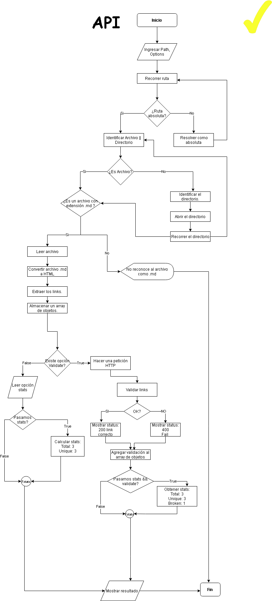
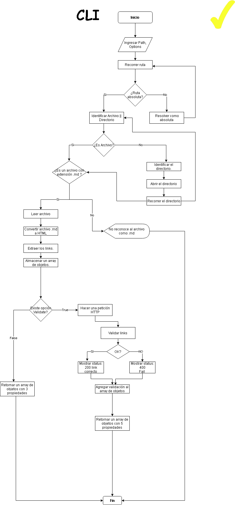

```
                 __  __            _       _
                |  \/  | __ _ _ __| | ____| | _____      ___ __
                | |\/| |/ _` | '__| |/ / _` |/ _ \ \ /\ / / '_ \
                | |  | | (_| | |  |   < (_| | (_) \ V  V /| | | |
 📦📦📦📦📦📦 |_|  |_|\__,_|_|  |_|\_\__,_|\___/ \_/\_/ |_| |_| 📦📦📦📦📦📦

 ```
 La librería 'Marckdownd-Links'sirve para detectar los links que contiene un archivo con extensión .md, y hace cálculos estadísticos con respecto al total, unique y los links broken.

## 📌**Diagramas de Flujo**





## 📌**Instalación**

📍 **Global**
```javascript
npm install -g git://github.com/RLCHuncp/LIM012-fe-md-links
```
📍 **Local**
```javascript
npm install git://github.com/RLCHuncp/LIM012-fe-md-links
```
## 📌**Para usarlo**

✒️**JAVASCRIPT API**

**Importa como módulo**
```javascript
const { mdLinks } = require('mdlinks');

```
Por ejemplo:

```javascript
const { mdLinks } = require("mdlinks");

mdLinks("./some/example.md")
  .then(links => {
    // => [{ href, text, file }]
  })
  .catch(console.error);

mdLinks("./some/example.md", { validate: true })
  .then(links => {
    // => [{ href, text, file, status, ok }]
  })
  .catch(console.error);

mdLinks("./some/dir")
  .then(links => {
    // => [{ href, text, file }]
  })
  .catch(console.error);

```

✒️**Através de línea de comandos (CLI)**

```
md-links <path-to-file> [options]
```

|                Instrucciones                  |
| ----------------------------------------------|
|⚠️md-links `<path-to-file>`                       |
|⚠️md-links `<path-to-file>` --validate ó --v        |
|⚠️md-links `<path-to-file>` --stats ó --s                |
|⚠️md-links `<path-to-file>` --stats --validate ó --s --v |

Por ejemplo:

```
🔰 Sin optión:
```

```javascript
$ md-links 'probando/README.md'
  ◾️HREF: https://www.flaticon.es/
  ◾️TEXT: Este es el link
  ◾PATH: C:\Users\LUCY\Desktop\Lista-Tareas\probando\README.md
```

```
🔰 --validate
```

```javascript
$ md-links 'probando/README.md' --validate

  HREF: https://www.flaticon.es/
  TEXT: Este es el link
  PATH: C:\Users\LUCY\Desktop\Lista-Tareas\probando\README.md
  STATUS: 200
  STATUSTEXT: OK

  HREF: https://lms.laboaaaaaratoria.l/
  TEXT: Este es el link no existe
  PATH: C:\Users\LUCY\Desktop\Lista-Tareas\probando\README.md
  STATUS:
  STATUSTEXT: Este link no existe
```

```
🔰 --stats
```

```javascript
$ md-links 'probando/README.md' --stats
  ✔️  TOTAL: 5
  ✔️  UNIQUE: 5
```
```
🔰 --stats --validate
```

```javascript
$ md-links 'probando/README.md' --stats --validate
  ✔️  TOTAL: 5
  ✔️  UNIQUE: 5
  ❌  BROKEN: 1
```
